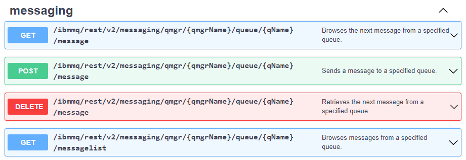

# Descrição #

Projeto que define a API REST para ser utilizada como ponte de conexão com um IBM MQ 8.0+ (ainda não foi testada com a versão 7.5.0.5). Todos os códigos do repositório são destinados a serem utilizados dentro de Lambdas na Plataforma AWS.

Cabe destacar que a versão 9.2.2 possui uma API REST madura, no entanto, como ainda utilizamos a versão 7.5.0.5 do IBM MQ no ambiente de Produção e Homologação, necessitamos de um **"Emulador"** da API REST para que futuros projetos possam utilizar o IBM MQ sem acessá-la diretamente.



## Preparando o Ambiente de Desenvolvimento e Testes
### Instalações
É preciso ter instalado em sua máquina as seguintes tecnologias para poder atuar no projeto:
* [AWS CLI](https://docs.aws.amazon.com/cli/latest/userguide/install-cliv2.html)
* [npm](https://www.npmjs.com/get-npm)
* [Serverless Framework](https://www.serverless.com/framework/docs/getting-started/)
* [VS Code](https://code.visualstudio.com/Download) como IDE sugerida

### Configurações
Para testar o projeto em ambiente de desenvolvimento é necessário possuir configurado em sua máquina o AWS CLI, que é o client para publicar o projeto como uma stack via AWS Cloudformation. Para isso, é preciso, com o AWS CLI instalado, abra um promt de comando e digite o comando a seguir, respondendo as perguntas em seguida conforme o exemplo abaixo, conforme orientado na [documentação oficial](https://docs.aws.amazon.com/cli/latest/userguide/cli-configure-files.html):

```bash
$ aws configure
AWS Access Key ID [None]: ********************
AWS Secret Access Key [None]: ****************************
Default region name [None]: us-east-2
Default output format [None]: json
```

Entre em contato com o time de infraestrutura para obter o **AWS Access Key ID** e o **AWS Secret Access Key** para o ambiente de desenvolvimento.

É necessário também que a [Layer Bridge-Ibmmq](https://bitbucket.org/tigestao-smartbank/bridge_ibmmq_layer) seja baixada para localmente para posterior apontamento ou rebuild da mesma.

## Utilização
Este projeto é composto pelo código fonte escrito em JavaScript e expõe 4 endpoints na Api Gateway de uso interno da LetsBank, denominada **Internal API**.

Os parâmetros de conexão com o IBM MQ como **hostIP**, **hostPort**, **userId**, **password** e **channelName** são armazenados em um no Secrets Manager [resources-master-password](https://us-east-2.console.aws.amazon.com/secretsmanager/home?region=us-east-2#!/secret?name=dev-resources-master-password), responsavel por armazenar credenciais e senhas de uso dos sistemas da LetsBank.

Em DEV o Secret estão dentro do objeto **ibmMq**, com os seguintes atributos: "host","port","ch","qm","usr e "pwd". Os segredos são integrados ao ambiente da stack em tempo de deploy, populando variáveis de ambiente que serão utilizadas nas lambdas internamente para realizar a conexão.

Desde que haja uma conexão estabelecida com um IBM MQ, não há qualquer impedimento desta lib ser utilizada com um MQ A ou B desde que sejam respeitadas as versões testadas.

Para a realização do deploy  do projeto em **dev** basta que no prompt de comando executemos o seguinte comando dentro do diretório raiz do projeto.

```bash
$ serverless deploy --env dev
```

Caso você queira remover a stack criada, utilize o comando:

```bash
$ serverless remove --env dev
```

## BRIDGE-IBMMQ - Especificação dos Endpoints da API REST

**BRIDGE-IBMMQ - Endpoints da API REST em DEV**

* **LIST_MESSAGES**
  * **GET** - https://05ovjshnib-vpce-015b80d1657e30f4b.execute-api.us-east-2.amazonaws.com/dev/ibmmq/rest/v2/messaging/qmgr/{qmgrName}/queue/{qName}/messagelist
   * **Descrição:** Recupera **não-destrutivamente** a lista de mensagens disponíveis na fila do IBM MQ
   * **Parâmetros:**
     *  correlationId:string (Query - Opcional) - Uma string hexadecimal de 48 caracteres que representa o correlation ID
     *  messageId:string (Query - Opcional) -  Uma string hexadecimal de 48 caracteres que representa o message ID
     *  limit:string = 10000 (Padrão) (Query - Opcional) - O número máximo de elementos para serem retornados
     *  ibm-mq-rest-csrf-token: string (Header - Opcional) - O cabeçalho de proteção CSRF. O valor pode ser qualquer valor inclusive pode ser deixado em branco
     *  qmgrName:string (Path - Obrigatório) - O nome do Gerenciador de Filas a ser utilizado
     *  qName:string (Path - Obrigatório) - O nome da Fila a ser utilizada
 
* **DELETE_MESSAGE**
  * **DELETE** - https://05ovjshnib-vpce-015b80d1657e30f4b.execute-api.us-east-2.amazonaws.com/dev/ibmmq/rest/v2/messaging/qmgr/{qmgrName}/queue/{qName}/message
  * **Descrição:** Recupera destrutivamente a próxima mensagem disponível na fila do IBM MQ.
  * **Parâmetros:**
     *  correlationId:string (Query - Opcional) - Uma string hexadecimal de 48 caracteres que representa o correlation ID.
     *  messageId:string (Query - Opcional) - Uma string hexadecimal de 48 caracteres que representa o message ID.
     *  wait:string (Query - Opcional) - A duração máxima para aguardo da próxima mensagem (em milisegundos).
     *  ibm-mq-rest-csrf-token: string (Header - Opcional) - O cabeçalho de proteção CSRF. O valor pode ser qualquer valor inclusive pode ser deixado em branco
     *  qmgrName:string (Path - Obrigatório) - O nome do Gerenciador de Filas a ser utilizado
     *  qName:string (Path - Obrigatório) - O nome da Fila a ser utilizada
 
* **GET_MESSAGE**
  * **GET** - https://05ovjshnib-vpce-015b80d1657e30f4b.execute-api.us-east-2.amazonaws.com/dev/ibmmq/rest/v2/messaging/qmgr/{qmgrName}/queue/{qName}/message
  * **Descrição:** Recupera não-destrutivamente a próxima mensagem disponível na fila do IBM MQ.
  * **Parâmetros:**
     *  correlationId:string (Query - Opcional)  - Uma string hexadecimal de 48 caracteres que representa o correlation ID.
     *  messageId:string (Query - Opcional) - Uma string hexadecimal de 48 caracteres que representa o message ID.
     *  ibm-mq-rest-csrf-token: string (Header - Opcional) - O cabeçalho de proteção CSRF. O valor pode ser qualquer valor inclusive pode ser deixado em branco
     *  qmgrName:string (Path - Obrigatório) - O nome do Gerenciador de Filas a ser utilizado
     *  qName:string (Path - Obrigatório) - O nome da Fila a ser utilizada

* **POST_MESSAGE**
  * **POST** - https://05ovjshnib-vpce-015b80d1657e30f4b.execute-api.us-east-2.amazonaws.com/dev/ibmmq/rest/v2/messaging/qmgr/{qmgrName}/queue/{qName}/message
  * **Descrição:** Insere uma mensagem de texto codificada em UTF-8 em uma fila do IBM MQ.
  * **Parâmetros:**
     *  body:string (Header - Obrigatório) - Corpo da mensagem.
     *  ibm-mq-rest-csrf-token: string (Header - Opcional) - O cabeçalho de proteção CSRF. O valor pode ser qualquer valor inclusive pode ser deixado em branco
     *  ibm-mq-md-correlationId:string (Header - Opcional) - Uma string hexadecimal de 48 caracteres que representa o correlation ID.
     *  ibm-mq-md-expiry:string (Header - Opcional) - Tempo máximo de permanência da mensagem na Fila (em milisegundos)
     *  ibm-mq-md-persistence:string (Header - Opcional) - Indica o tipo de persistência da mensagem na Fila. Valores disponíveis: [nonPersistent, persistent]. Valor padrão: nonPersistent
     *  ibm-mq-md-replyTo:string (Header - Opcional) - Destino de reply-to para a mensagem. (Formato: myReplyQueue[@myReplyQMgr])
     *  qmgrName:string (Path - Obrigatório) - O nome do Gerenciador de Filas a ser utilizado
     *  qName:string (Path - Obrigatório) - O nome da Fila a ser utilizada